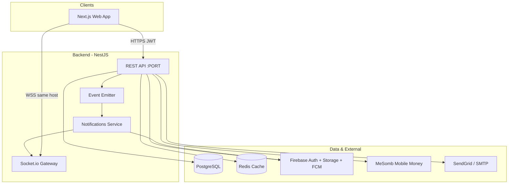

# CuisineEase — Architecture

**Last updated:** 2026-06-11

---

## System context



---

## Frontend (`app/`)

### Stack

| Layer | Technology |
|-------|------------|
| Framework | Next.js 14 App Router, React 18, TypeScript |
| Styling | Tailwind CSS, shadcn/ui (Radix) |
| Server state | TanStack Query v5 |
| HTTP | Axios singleton (`src/lib/api.ts`) |
| Auth session | JWT in cookie + localStorage; Firebase for Google |
| i18n | i18next (en/fr), client-side |
| Realtime | socket.io-client |

### Layering

```
src/app/           → Routes & page composition (by role)
src/components/    → UI components (domain + shared)
src/hooks/         → React Query wrappers, sockets, live refresh
src/services/      → API client functions (thin)
src/type/          → TypeScript DTOs mirroring API
src/config/        → Nav configs per role
src/lib/           → api, auth helpers, wsUrl, utils
src/middleware.ts  → JWT role gate for protected prefixes
```

### Auth & routing flow

1. User signs in → `POST /auth/login` | `/auth/register` | `/auth/google`
2. `persistAuthSession()` stores tokens + role claims
3. `middleware.ts` decodes JWT, maps role → allowed path prefix
4. Manager with `restaurantId` claim routes to `/manager` (pending/suspended guards in layout)

### API integration conventions

- Base URL: `NEXT_PUBLIC_API_URL`
- Response envelope (when used): `{ success, message, data, meta, errors }`
- Services `unwrap()` `data` field
- Normalization at service boundary (e.g. `normalizeOrder`, snake_case → camelCase)
- UUID vs Firebase UID: use `getUuidBackedUserId()` for Postgres-backed APIs

### Realtime

- `getWebSocketUrl()` → API host (optional `NEXT_PUBLIC_WS_URL` override)
- `useNotificationLive` — polling + focus refresh for notification badges
- `useChatLive` — socket + 5s polling for chat badges
- `useChatSocket` — patches message/conversation caches on `chat:message:new`

### Role-specific UI shells

| Role | Layout | Nav config |
|------|--------|------------|
| Customer | `customer/layout.tsx` | `config/customerNav.ts` |
| Manager | `manager/layout.tsx` | `config/managerNav.ts` |
| Platform admin | `dashboard/layout.tsx` | `config/platformAdminNav.ts` |
| Delivery | No shared layout (minimal pages) | — |

---

## Backend (`backend/`)

### Stack

| Layer | Technology |
|-------|------------|
| Framework | NestJS 11, Express |
| ORM | TypeORM 0.3, PostgreSQL |
| Cache | Redis (ioredis) |
| Auth | Firebase Admin JWT, global `FirebaseGuard` |
| Realtime | Socket.io via `IoAdapter` on main HTTP server |
| Events | `@nestjs/event-emitter` |
| Docs | Swagger at `/api` |

### Module map

| Module | Responsibility |
|--------|----------------|
| `auth` | Login, register, Google, refresh, email verify, password reset |
| `user` | Profiles, favorites, device tokens, notification prefs, restaurant roles |
| `restaurant` | CRUD, status, schedules, onboarding |
| `menu-item`, `ingredient`, `add-on` | Catalog per restaurant |
| `cart` | Pre-checkout cart |
| `orders` | Order lifecycle, event listeners |
| `reservations` | Table bookings |
| `tables` | Physical tables + sections |
| `floor` | TableSession, Guest, floor map, billing, session payments (waitstaff) |
| `payment` | Payment records, gateway resolver (MeSomb, cash) |
| `delivery` | Delivery assignment; hooks chat open/close |
| `chat` | Conversations, messages, image attachments |
| `notifications` | Persist, WebSocket emit, FCM push |
| `review` | Restaurant reviews |
| `address` | Addresses |
| `storage` | Upload abstraction (Firebase default, Google Drive optional) |
| `emails`, `mail` | Transactional email |
| `contact` | Public contact form |
| `config` | Public client config (fees, etc.) |

### Request pipeline

```
Request
  → FirebaseGuard (global, deny-by-default)
  → @Public() bypass where marked
  → RolesGuard (selective controllers)
  → ValidationPipe
  → Controller → Service → Repository
  → apiSuccess() envelope (most services)
  → HttpExceptionFilter on errors
```

### Authorization model (dual)

1. **System role** — `admin` | `user` | `delivery`
2. **Restaurant role** — per `user_restaurant_roles` table

`RolesGuard` checks restaurant context from params/query/body when present.

**Restaurant-scoped access:** `RestaurantAccessService` (`common/restaurant-access/`) is the preferred guard for waitstaff flows — `assertWaitstaffOrAbove`, `assertChefOrAbove`, `assertManagerOrAbove`, `assertRestaurantIdMatch`, `getRestaurantRole`.

**Known gap:** Frozen `tables.controller.ts` write endpoints lack RBAC (SEC-001 in `ai/SECURITY_BACKLOG.md`). Waitstaff uses secured `floor` module instead. Not all legacy controllers use `RolesGuard`; chat and orders use service-level checks for staff with `SystemRole.USER`.

### Chat architecture

**Entities:** `chat_conversations`, `chat_participants`, `chat_messages`

**Conversation types:**
- `customer_restaurant` — one thread per customer+restaurant pair
- `customer_driver` — tied to delivery; closes on terminal delivery status

**Access rules:**
- Customers start restaurant chats; staff start with `customerId`
- Staff synced as participants on access
- Driver chat only while delivery active with assigned driver

**Realtime:** `chat:message:new`, `chat:conversation:updated` via `NotificationsGateway.emitToUser`

### Notifications architecture

1. Domain event (order, reservation, etc.) → listener
2. `NotificationsService.create` persists rows
3. WebSocket to `user:{id}` rooms
4. FCM to registered device tokens

Socket rooms on connect: `user:{id}`, `admin`, `delivery`, `notifications:*`

**Restaurant realtime (waitstaff):** Clients emit `join:restaurant` with `restaurantId`; server verifies `user_restaurant_roles` before joining `restaurant:{id}`. Prior restaurant room is left on switch. Events: `floor:updated`, `table-session:created|updated`, `order:updated`, `payment:recorded`, `reservation:updated` — payloads carry IDs only; data fetched via secured REST.

### Waitstaff dine-in model

- **`TableSession`** — operational dine-in state (seated → ordering → bill requested → completed)
- **`Table.status`** — physical asset only (available / occupied / reserved / out_of_service); updated on seat, transfer, close
- **Orders** — dine-in orders link `tableSessionId` + `restaurantId`; workflow via role-specific endpoints + `updateSecured`
- **Payments** — dine-in via `POST /table-sessions/:id/payments` (`tableSession` + `restaurant` on entity)
- **Guests** — scoped under `/restaurants/:restaurantId/guests`

See `ai/security/WAITSTAFF_SECURITY_AUDIT.md` for endpoint-level RBAC matrix.

### Storage

```
StorageService → StorageProviderRegistry
  ├── FIREBASE (default if STORAGE_TYPE unset)
  └── GOOGLE_DRIVE (optional)
```

Chat images: `POST /chat/conversations/:id/attachments` → `storage/chat/{conversationId}/`

### Database migrations

- Path: `backend/src/lib/database/migrations/`
- Run: `npm run build && npm run migration:run`
- **Never** rely on `synchronize` in production (`TYPEORM_SYNCHRONIZE` locked to non-prod)

Latest notable migration: `1772870000000-ChatTables.ts`

---

## Cross-cutting contracts

### API response envelope

```typescript
{
  success: boolean;
  message: string;
  data: T | null;
  meta?: object;
  errors?: object;
}
```

**Inconsistency:** Some endpoints return raw shapes. Frontend services generally expect `data` wrapper.

### Identifiers

- Postgres UUIDs for domain entities (`user.id`, `order.customerId`, etc.)
- Firebase UID in JWT `sub` / `uid` — resolved server-side via `getUserByUidOrId`

### CORS & origins

Centralized in `backend/src/config/app-urls.ts`:
- `FRONTEND_URL`, `CORS_ORIGINS` env overrides
- Defaults include localhost + production frontend

---

## Deployment architecture

| Service | Platform | Notes |
|---------|----------|-------|
| Frontend | Vercel | `NEXT_PUBLIC_*` env vars |
| Backend | Render | Free tier cold start; `warmBackend()` in frontend |
| DB | External PostgreSQL | SSL via `DB_SSL` |
| Redis | External or local | Cache module |

**WebSocket:** Must share API port (not separate :3002). Frontend `NEXT_PUBLIC_WS_URL` should equal API origin.

---

## Security posture

| Control | Status |
|---------|--------|
| Global Firebase JWT guard | ✅ Active |
| `@Public()` for browse endpoints | ✅ Selective |
| Role guards | ⚠️ Partial coverage |
| CORS allowlist | ✅ Configurable |
| TYPEORM synchronize in prod | ✅ Disabled by default |
| Tables controller guards | ⚠️ Commented out |

---

## Testing architecture (current)

- Unit: ~24 spec files, mostly `should be defined`
- E2E: single `GET /` test
- Pre-commit: format, lint, types, **build** (no test run)
- **Target state:** domain integration tests for orders, auth, chat, payments

---

## Architecture evolution notes

When adding features:

1. Add migration if schema changes
2. Follow module pattern: entity → dto → service → controller
3. Emit domain events if notifications needed
4. Add frontend service + hook + types
5. Update `ai/TASKS.md` and `ai/DECISIONS.md`

See `ai/AGENT.md` for agent workflow. End-to-end flows and portal specs: `ai/workflow/README.md`, `ai/features/README.md`.
