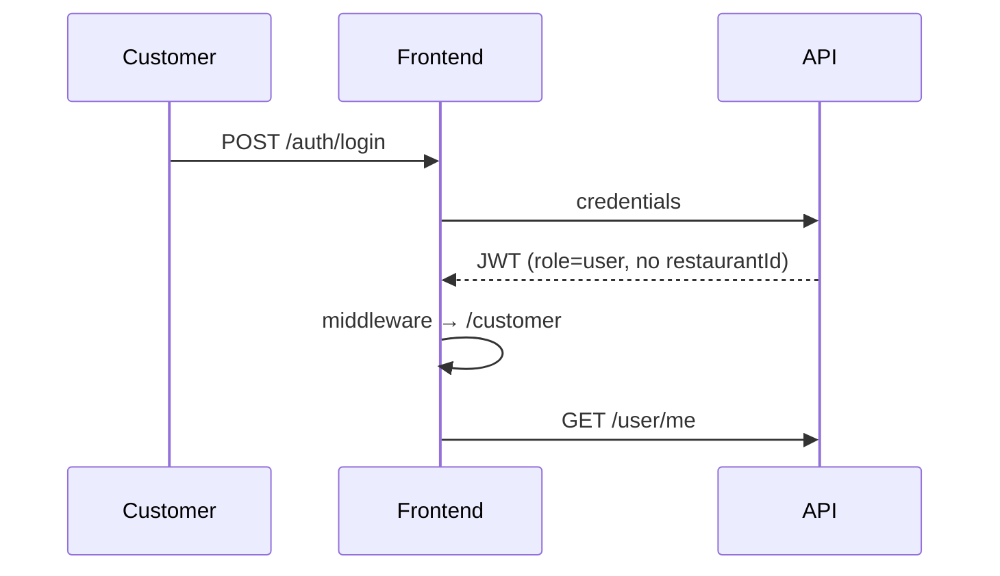
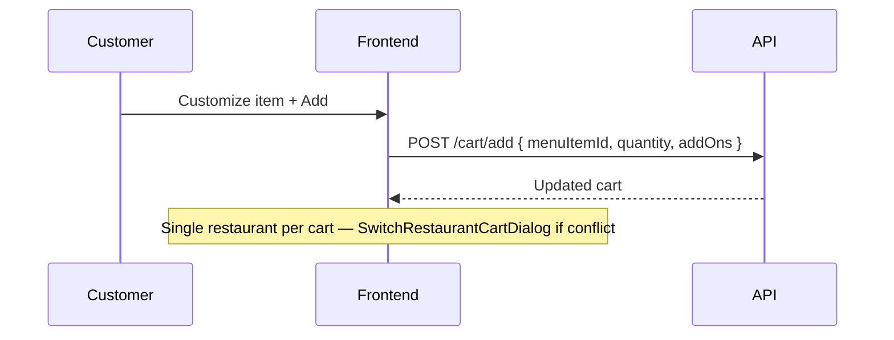
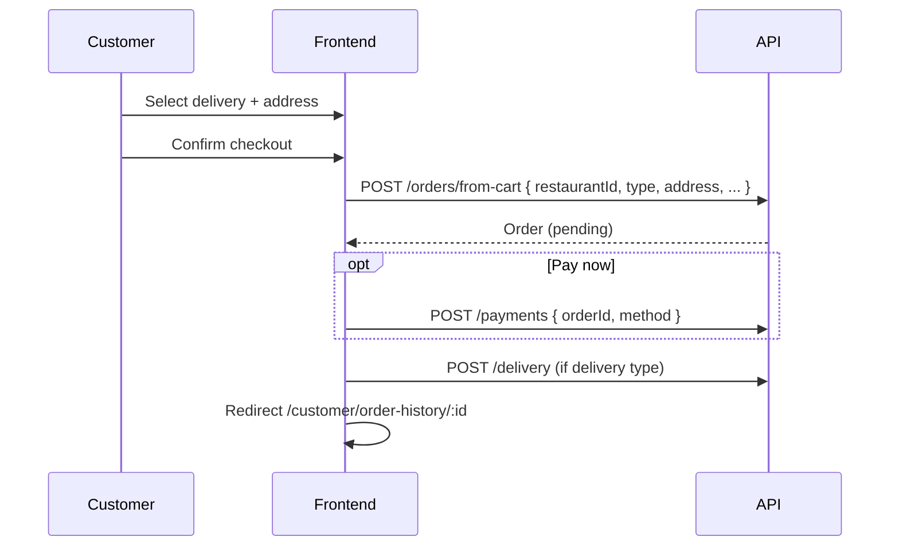
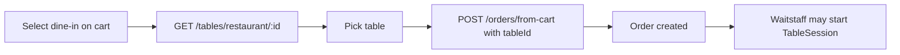
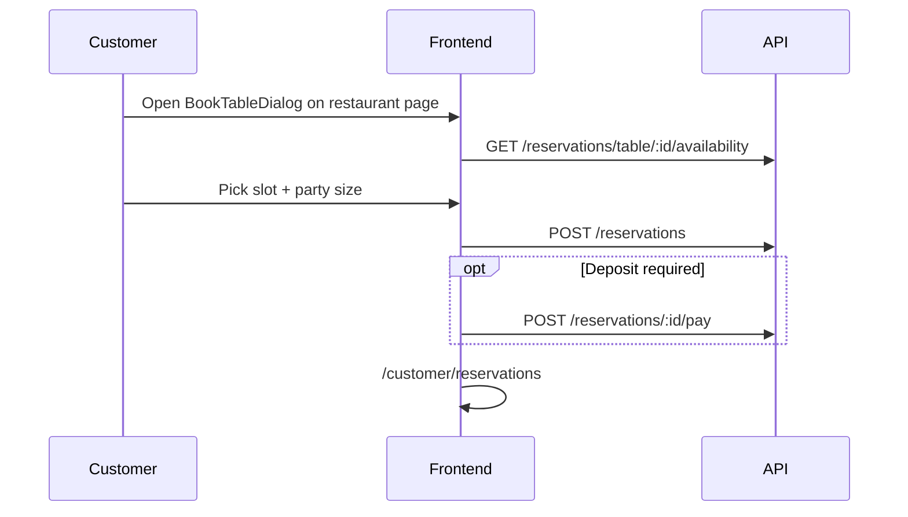

# Customer Portal — Flows

**Last updated:** 2026-06-11

Step-by-step journeys for the customer portal. For API details see [../../workflow/API_MAP.md](../../workflow/API_MAP.md).

---

## 1. Login & portal entry



**Post-login path:** System role `user` without `restaurantId` → `/customer`.

---

## 2. Discover restaurants

```mermaid
flowchart LR
  A[/customer/restaurants] --> B[GET /restaurant]
  B --> C[Filter/search/near-me client-side]
  C --> D[/customer/restaurants/id]
  D --> E[GET /restaurant/:id]
  D --> F[GET /menu-item?restaurantId=]
```

**Favorites:** `POST/DELETE /user/favorite-restaurants` from restaurant cards.

**Home menu:** `/customer` shows featured categories and items via menu hooks.

---

## 3. Add to cart



**Service:** `app/src/services/cart.ts`  
**Hook:** `useCart`

---

## 4. Checkout — delivery



**Page:** `/customer/cart`  
**Components:** `DeliveryDetailsCard`, `PaymentDetailCard`, `CartOrderSummary`

---

## 5. Checkout — takeout

Same as delivery without address/delivery record. Pickup time collected in checkout form.

---

## 6. Checkout — dine-in



Customer selects a table at checkout. Operational dine-in session (`TableSession`) is typically opened by waitstaff when guest is seated — see [../waitstaff/WAITSTAFF_COMPLETION_REPORT.md](../waitstaff/WAITSTAFF_COMPLETION_REPORT.md).

---

## 7. Order tracking

```mermaid
flowchart TB
  A[/customer/order-history] --> B[GET /orders?customer scoped]
  B --> C[/customer/order-history/id]
  C --> D[ProgressReport + map if delivery]
  C --> E[DeliveryDriver component]
  C --> F[Chat with restaurant/driver]
```

**Notifications:** Order status changes emit `notification:new` to customer user room.

---

## 8. Table reservation



**Components:** `BookTableDialog.tsx`, `RestaurantTablesTab.tsx`  
**List page:** `/customer/reservations` → `GET /reservations/me`

---

## 9. Chat

```mermaid
flowchart LR
  A[/customer/chats] --> B[GET /chat/conversations]
  B --> C[Select thread]
  C --> D[GET/POST messages]
  D --> E[WS chat:message:new]
```

| Thread type | When |
|-------------|------|
| `customer_restaurant` | Any time with restaurant |
| `customer_driver` | Active delivery on order |

**Layout hook:** `useChatLive(userId)` in customer layout.

---

## 10. Notifications

```mermaid
flowchart LR
  A[Domain event] --> B[NotificationsService]
  B --> C[WS notification:new]
  C --> D[useNotificationLive]
  D --> E[/customer/notifications]
```

Bell in top nav; full inbox at `/customer/notifications`.

---

## 11. Profile & settings

| Route | Flow |
|-------|------|
| `/customer/settings` | Profile hub |
| `/customer/settings/security` | Password / auth |
| `/customer/settings/notification` | `GET/PATCH /user/notification-preferences` |
| `/customer/settings/preferences` | App preferences |
| Settings sections | Addresses via `address.ts`, photo upload |

---

## 12. Reviews

After completed order, customer may submit review:

`POST /review` with `menuItemId`, rating, comment — from order detail or restaurant page components.

---

## 13. Statistics

`/customer/statistics` — client aggregates order history (spend, frequency). No dedicated analytics API.

---

## Customer ↔ other portals

| Event | Customer sees | Other portal |
|-------|---------------|--------------|
| Order placed | Confirmation + notification | Manager `/manager/orders` |
| Delivery assigned | Driver info + chat | Delivery `/delivery` |
| Reservation booked | `/customer/reservations` | Waitstaff `/waitstaff/reservations` |
| Dine-in seated | Table on order | Waitstaff floor session |
| Order ready (delivery) | Tracking update | Manager/driver |

---

## Related

- [SPEC.md](./SPEC.md)
- [../../workflow/SYSTEM_FLOWS.md](../../workflow/SYSTEM_FLOWS.md)
