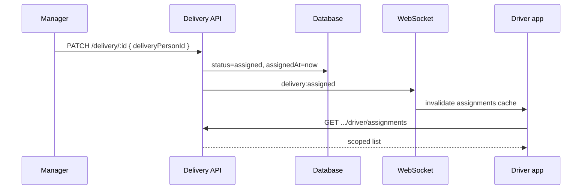
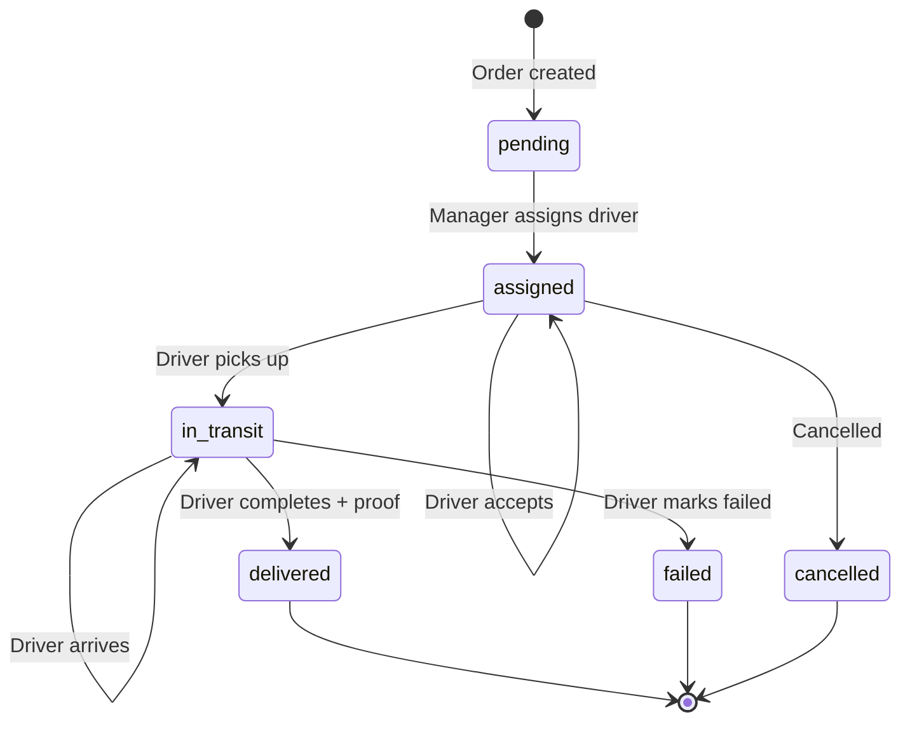
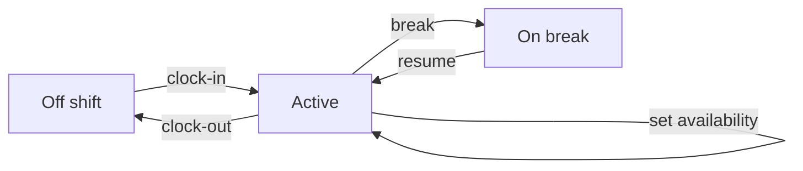

# Driver Dashboard — System Flows

**Date:** 2026-06-11

---

## 1. Assignment flow



---

## 2. Delivery workflow



Each transition:
1. `POST .../driver/assignments/:id/status`
2. Insert `delivery_events` row
3. `ChatService.onDeliveryUpdated` (close chat on terminal states)
4. `emitDeliveryUpdated` to restaurant + driver rooms

---

## 3. Shift flow



---

## 4. Chat flow

1. Manager assigns driver → `onDeliveryUpdated` creates `customer_driver` conversation
2. Driver opens Messages or taps chat on delivery card
3. `createConversation({ deliveryId })` idempotent
4. Messages via existing chat WebSocket events

---

## 5. Offline sync flow

1. Driver loses connectivity — banner shown
2. Actions queued locally (future: IndexedDB)
3. On reconnect: `POST .../driver/sync` with `idempotencyKey` per action
4. Backend replays status/proof; marks `driver_offline_actions.appliedAt`

---

## 6. Realtime subscription

```
Driver connects → joins user:{id}, delivery, restaurant:{id}
Events: delivery:*, driver:shift:updated
Frontend: useDriverLive → invalidate React Query keys
```

---

## 7. RBAC decision tree

```
Request to driver API
  → FirebaseGuard (JWT valid?)
  → resolveUser(uid)
  → assertDeliveryOrAbove(uid, restaurantId)
  → filter/query by deliveryPerson.id == user.id
```
