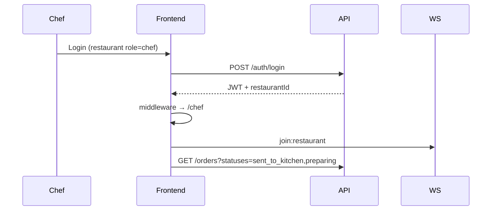
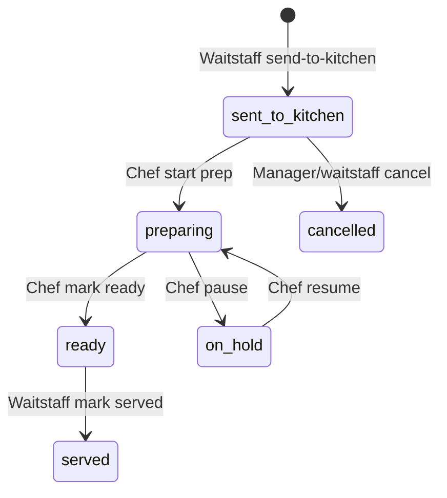
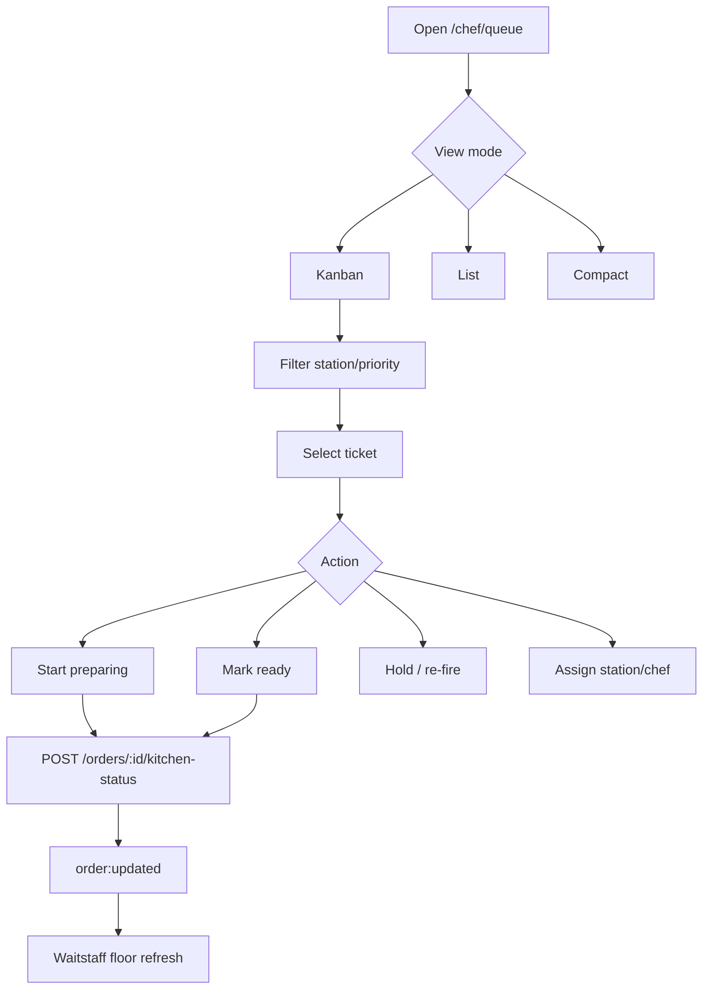
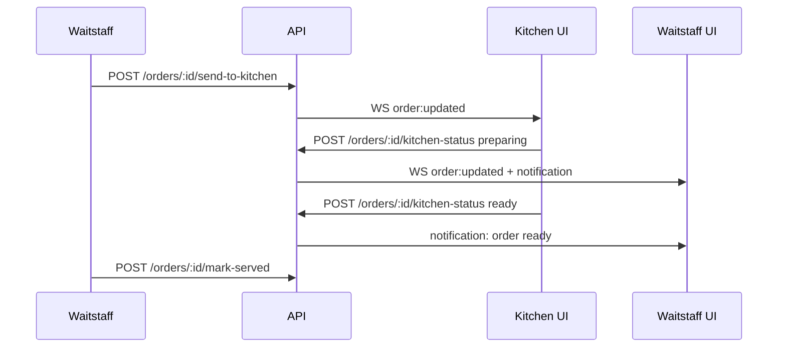
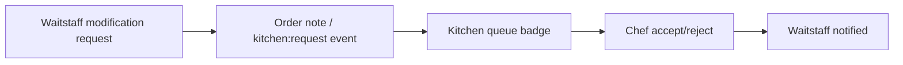
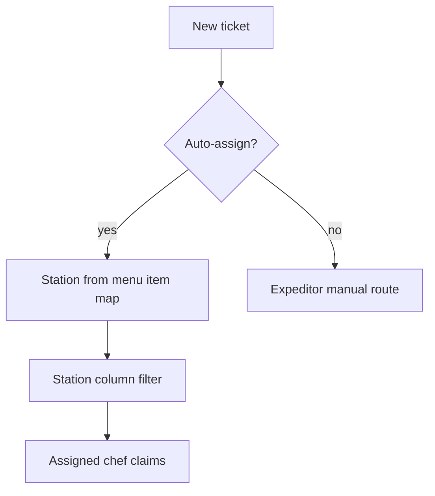
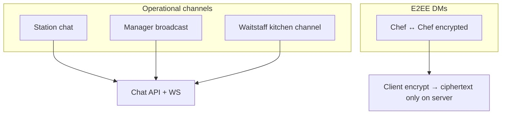
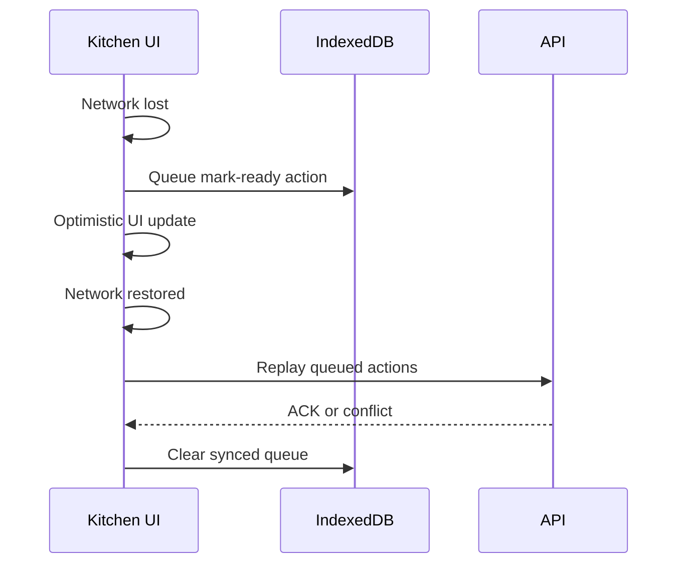

# Kitchen Dashboard — Flows

**Last updated:** 2026-06-11  
**Spec:** [SPEC.md](./SPEC.md)

---

## 1. Chef login & portal entry



---

## 2. Core ticket lifecycle (today + target)



**Today:** `/chef` lists `sent_to_kitchen` and `preparing`; buttons call `advanceKitchenOrderStatus`.  
**Target:** Full queue UI with timers, stations, bulk actions, WS-driven refresh.

---

## 3. Kitchen Queue — primary workflow



---

## 4. Waitstaff → kitchen → waitstaff



---

## 5. Modification & collaboration



---

## 6. Station routing (target)



---

## 7. Internal messages



---

## 8. Offline action sync



---

## 9. Manager monitoring

```mermaid
flowchart LR
  M[/manager/orders] --> R[Read-only queue mirror]
  M --> A[/chef/analytics read-only export]
  M --> I[Optional kitchen:intervene]
  I --> P[Priority bump / cancel with reason]
```

---

## 10. Tickets history replay

```mermaid
flowchart LR
  H[/chef/history] --> Q[Search filters]
  Q --> T[Timeline API]
  T --> E1[sent_to_kitchen @ T1 by waitstaff]
  T --> E2[preparing @ T2 by chef A]
  T --> E3[ready @ T3 by chef A]
  T --> E4[served @ T4 by waitstaff]
```

---

## 11. Inventory impact (read-only)

```mermaid
flowchart LR
  I[/chef/inventory] --> L[Low stock API]
  L --> M[Map to menu items]
  M --> Q[Highlight affected tickets in queue]
```

---

## Cross-references

- Dine-in system flow: [../../workflow/SYSTEM_FLOWS.md](../../workflow/SYSTEM_FLOWS.md) §4
- Waitstaff handoff: [../waitstaff/FLOWS.md](../waitstaff/FLOWS.md)
- API map (planned extensions): [../../workflow/API_MAP.md](../../workflow/API_MAP.md)
