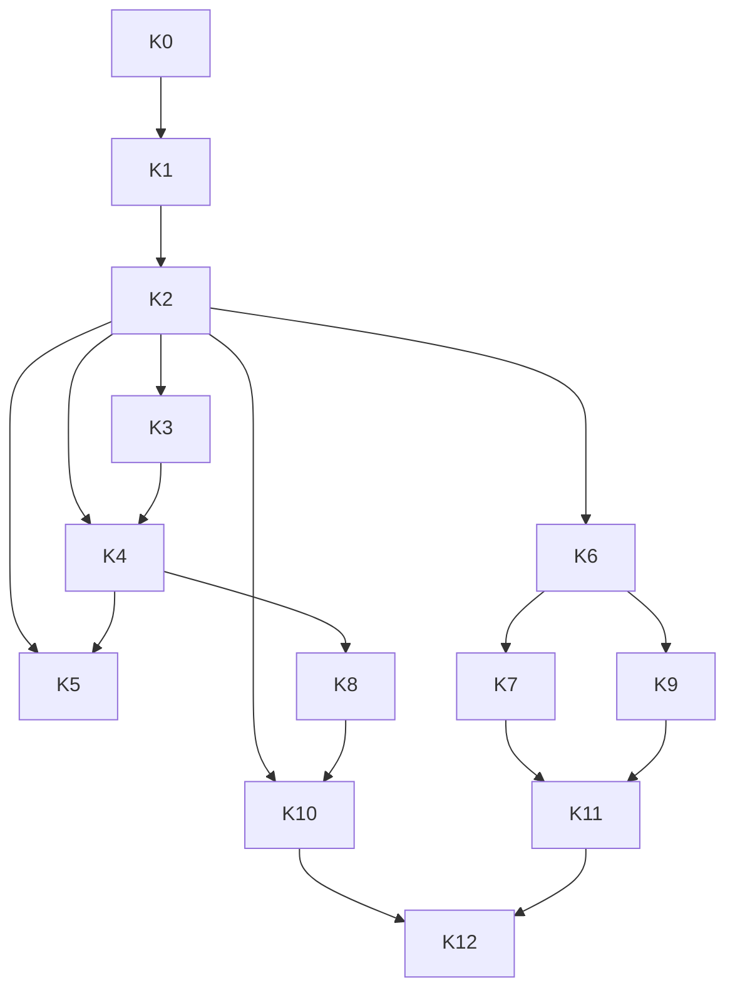

# Kitchen Dashboard — Implementation Roadmap v2

**Date:** 2026-06-11  
**Version:** 2.0 (enterprise-complete)  
**Spec:** [SPEC.md](./SPEC.md)  
**Review:** [ENTERPRISE_REVIEW.md](./ENTERPRISE_REVIEW.md)  
**Status:** Not started

---

## How to use this roadmap

| Symbol | Meaning |
|--------|---------|
| **P0** | Production blocker |
| **P1** | Enterprise parity |
| **P2** | Differentiator / advanced |

Each phase has **dependencies**, **deliverables**, **acceptance criteria**, **exit conditions**, **risks**, and **docs to update**.

**Quality gate (every phase):** axe a11y scan, EN+FR keys for new UI, RBAC integration test, update `ai/workflow/API_MAP.md` if endpoints added.

---

## Phase overview

| Phase | Name | Priority | Outcome |
|-------|------|----------|---------|
| **K0** | Platform prerequisites | P0 | Shared contracts, RBAC, order API enrichment |
| **K1** | Portal shell & navigation | P0 | Full nav, i18n, profile/settings, help |
| **K2** | Kitchen Queue core | P0 | Production ticket processing + WS |
| **K3** | Stations & routing | P0 | Station model, claim, capacity |
| **K4** | Queue advanced & history | P1 | Grouping, views, audit, active lane |
| **K5** | Ticket detail & partial prep | P1 | Detail panel, recipes, item-level status |
| **K6** | Realtime & presence | P1 | Full event taxonomy, reconnect |
| **K7** | Collaboration & team chat | P1 | Channels, mentions, waitstaff bridge |
| **K8** | Analytics, performance & AI | P1 | Metrics, heatmaps, suggestions |
| **K9** | Offline & resilience | P1 | IndexedDB sync, conflict handling |
| **K10** | Performance & scale | P1 | Virtualization, load tests, TV mode |
| **K11** | Security & E2EE | P2 | Hardening, encrypted DMs, audit |
| **K12** | Enterprise QA & sign-off | P0 | Full test matrix, completion report |

---

## K0 — Platform prerequisites

**Goal:** Unblock kitchen work without rework.

### Dependencies

- Waitstaff dine-in flow live (`send-to-kitchen`)
- `RestaurantAccessService.assertChefOrAbove` available

### Deliverables

| ID | Deliverable |
|----|-------------|
| K0-1 | ADR in `DECISIONS.md`: kitchen module boundaries + event taxonomy |
| K0-2 | Extend order detail API: line items, allergens, modifiers, table session, `version` column |
| K0-3 | Migration: `orders.version` (optimistic lock), indexes on `(restaurant_id, status, updated_at)` |
| K0-4 | RBAC integration tests: chef cannot read other restaurant orders |
| K0-5 | Feature flag: `restaurant.settings.kitchenEnabled` (default true for active) |
| K0-6 | Upgrade `KitchenDisplayService` interface — hook WS emit stub |

### Acceptance criteria

- [ ] `GET /orders/:id` returns items with allergen flags for chef role
- [ ] Concurrent kitchen-status updates return 409 on version mismatch
- [ ] Security event logged on cross-tenant access attempt

### Exit conditions

Backend order enrichment merged; K0 tests green in CI.

### Risks

| Risk | Mitigation |
|------|------------|
| Order API breaking clients | Additive fields only; version optional until K2 |

### Documentation

- `ai/workflow/DATA_MODEL.md` — order.version, kitchen events
- `ai/DECISIONS.md` — ADR-015 kitchen module

---

## K1 — Portal shell & navigation

**Goal:** Enterprise navigation — no placeholder feel.

### Dependencies

- K0

### Deliverables

| ID | Deliverable |
|----|-------------|
| K1-1 | `app/src/app/chef/layout.tsx` — sidebar, top nav, mobile drawer |
| K1-2 | `app/src/config/chefNav.ts` — full nav (see ENTERPRISE_REVIEW §2) |
| K1-3 | Routes (shell + i18n empty states): dashboard, queue, active, stations, history, messages, team, alerts, shift, analytics, performance, inventory, activity, profile, settings, help |
| K1-4 | `chef:` namespace EN + FR — 100% shell strings |
| K1-5 | `useNotificationLive` + `useKitchenLive` (WS join + connection banner) |
| K1-6 | `/chef/profile` — restricted identity fields |
| K1-7 | `/chef/settings` — theme, language, sound, density, a11y toggles |
| K1-8 | Keyboard shortcuts modal (⌘K / `?`) |
| K1-9 | Tablet default route: `/chef/queue` (dashboard on desktop) |
| K1-10 | Remove legacy single-page `/chef` ticket UI — replace with dashboard |

### Acceptance criteria

- [ ] All nav routes reachable; no raw English in shell
- [ ] Language switch without reload
- [ ] Profile PATCH rejects name/email/role from chef
- [ ] axe scan passes on layout + settings + profile

### Exit conditions

Chef navigates full portal; connection indicator works; waitstaff/manager parity on shell polish.

### Risks

| Risk | Mitigation |
|------|------------|
| Nav overload on mobile | Collapse to Operations + More groups |

### Documentation

- `ai/features/kitchen/SPEC.md` §2 — sync nav table
- `.cursor/rules/kitchen-portal.mdc` — update routes

---

## K2 — Kitchen Queue core

**Goal:** Replace stub with production queue — **minimum viable enterprise ops**.

### Dependencies

- K0, K1
- Menu allergens in API response

### Deliverables

| ID | Deliverable |
|----|-------------|
| K2-1 | `GET /kitchen/queue` — paginated aggregated DTO |
| K2-2 | `/chef/queue` — Kanban, List, Compact modes |
| K2-3 | Ticket card: items, mods, allergens (red banner), table, priority, timer |
| K2-4 | Actions: start, ready, hold, resume, re-fire (1-tap on card) |
| K2-5 | Bulk select + batch advance |
| K2-6 | Search + filters (status, station, priority) |
| K2-7 | WS `order:updated` + new granular events (see K6 partial) |
| K2-8 | Waitstaff notifications: ready, delay, hold |
| K2-9 | `@tanstack/react-virtual` on list mode |
| K2-10 | Optimistic UI + rollback on error |
| K2-11 | Idempotency-Key on kitchen-status mutations |
| K2-12 | Audio toggle for new ticket (settings) |

### Acceptance criteria

- [ ] E2E: waitstaff send → chef start → chef ready → waitstaff notified < 5s
- [ ] 50 tickets scroll smoothly on iPad viewport
- [ ] Allergy flag visible without opening detail
- [ ] Two chefs racing on same order — one succeeds, one gets 409

### Exit conditions

Production kitchen can run lunch service on queue alone.

### Risks

| Risk | Mitigation |
|------|------------|
| WS missed events | Poll fallback every 30s configurable |

### Documentation

- `FLOWS.md` — update queue flow
- `ai/workflow/API_MAP.md` — `/kitchen/queue`

---

## K3 — Stations & routing

**Goal:** Multi-station kitchen routing and chef claim.

### Dependencies

- K2

### Deliverables

| ID | Deliverable |
|----|-------------|
| K3-1 | Entities: `kitchen_stations`, `menu_item_stations`, `kitchen_station_assignments` |
| K3-2 | Manager UI: `/manager/kitchen/stations` CRUD |
| K3-3 | `/chef/stations` — workload, capacity, delays |
| K3-4 | Queue filter by station; auto-route new tickets by menu map |
| K3-5 | Claim ticket (`POST /kitchen/queue/:orderId/claim`) |
| K3-6 | `KitchenStationService` + `KitchenAssignmentService` |
| K3-7 | `/chef/active` — in-progress fast lane |
| K3-8 | Station overload alert when capacity exceeded |

### Acceptance criteria

- [ ] Items route to correct station column
- [ ] Claimed ticket shows chef avatar; second claim rejected
- [ ] Manager can add "Grill" station without deploy

### Exit conditions

Multi-station restaurant config works end-to-end.

### Risks

| Risk | Mitigation |
|------|------------|
| Unmapped menu items | Default to "Expeditor" station |

### Documentation

- `DATA_MODEL.md` — station entities
- Manager spec cross-link for station admin

---

## K4 — Queue advanced, history & audit

**Goal:** Power-user queue + searchable history.

### Dependencies

- K2, K3

### Deliverables

| ID | Deliverable |
|----|-------------|
| K4-1 | Table grouping + course grouping headers |
| K4-2 | Drag-and-drop priority reorder (expeditor permission) |
| K4-3 | Saved views (`kitchen_saved_views`) |
| K4-4 | `order_kitchen_events` + `KitchenAuditService` |
| K4-5 | `/chef/history` — search, filters, replay timeline |
| K4-6 | `/chef/activity` — today's audit log |
| K4-7 | Waitstaff ↔ kitchen modification notes on ticket |
| K4-8 | VIP/reservation priority flag on ticket |
| K4-9 | Delivery order filter/column |
| K4-10 | `/chef/inventory` — low stock + affected tickets |

### Acceptance criteria

- [ ] History replay shows actor + timestamp for each transition
- [ ] Saved view persists per user across sessions
- [ ] Inventory low stock highlights tickets containing ingredient

### Exit conditions

Head chef can investigate any ticket from past 30 days.

### Documentation

- `SECURITY_REVIEW.md` — audit fields

---

## K5 — Ticket detail & partial preparation

**Goal:** Full ticket detail without leaving queue context.

### Dependencies

- K2, K4

### Deliverables

| ID | Deliverable |
|----|-------------|
| K5-1 | Order detail slide-over / split pane |
| K5-2 | Entity: `order_item_kitchen_status` |
| K5-3 | Partial item ready (multi-course) |
| K5-4 | `menu_item_prep` — recipe text, checklist, plating image |
| K5-5 | Timers per item + ticket |
| K5-6 | Internal notes (`order_kitchen_notes`) |
| K5-7 | Undo last action (30s window) via audit revert |
| K5-8 | Fire-later scheduling |
| K5-9 | Read-only payment/balance flag from table session |

### Acceptance criteria

- [ ] Mark 2 of 3 items ready; ticket stays preparing until all ready
- [ ] Undo reverts status within 30s
- [ ] Recipe visible from menu prep data

### Exit conditions

Line cook can complete complex ticket from detail panel on tablet.

---

## K6 — Realtime & presence

**Goal:** Enterprise-grade live sync.

### Dependencies

- K2

### Deliverables

| ID | Deliverable |
|----|-------------|
| K6-1 | Full WS event taxonomy (see ENTERPRISE_REVIEW §11) |
| K6-2 | `join:kitchen:{restaurantId}` room |
| K6-3 | Presence: chef online/offline |
| K6-4 | Typing indicators for team chat |
| K6-5 | Reconnect + `GET /kitchen/sync?since=` catch-up |
| K6-6 | `order.version` conflict on WS replay |
| K6-7 | Emit legacy `order:updated` alias |

### Acceptance criteria

- [ ] Disconnect 30s → reconnect → queue consistent without full reload
- [ ] 10 concurrent WS clients receive events < 300ms p95

### Exit conditions

Realtime layer production-ready for 100+ concurrent staff devices.

---

## K7 — Collaboration & team chat

**Goal:** Kitchen communication hub.

### Dependencies

- K1, K6

### Deliverables

| ID | Deliverable |
|----|-------------|
| K7-1 | Chat types: `kitchen_station`, `kitchen_broadcast`, `staff_operational` |
| K7-2 | `/chef/messages` — DMs (standard encryption in transit) |
| K7-3 | `/chef/team` — station + kitchen channels |
| K7-4 | Manager broadcasts + @mentions |
| K7-5 | Request assistance → ping assigned chef + manager |
| K7-6 | Task handoff linked to ticket claim |
| K7-7 | `/chef/alerts` — kitchen alert inbox |
| K7-8 | Attachments, threads (phase 7b) |

### Acceptance criteria

- [ ] Station channel only visible to assigned chefs + managers
- [ ] Waitstaff kitchen request appears on ticket + optional team channel

### Exit conditions

Kitchen runs shift without external radios for standard requests.

---

## K8 — Analytics, performance & AI

**Goal:** Insight + intelligent suggestions.

### Dependencies

- K4, K6

### Deliverables

| ID | Deliverable |
|----|-------------|
| K8-1 | `kitchen_metrics_daily` rollup job |
| K8-2 | `/chef/analytics` — trends, peak hours, heatmaps |
| K8-3 | `/chef/performance` — chef + station KPIs |
| K8-4 | `/chef/shift` — shift summary + handoff notes |
| K8-5 | `/chef` dashboard — live metrics widgets |
| K8-6 | Manager `/manager/kitchen` read-only monitor |
| K8-7 | `KitchenAIService` — delay ETA, batching, sequencing **suggestions** |
| K8-8 | Smart notification escalation rules |
| K8-9 | Export CSV |

### Acceptance criteria

- [ ] Analytics load < 2s p95 using rollups
- [ ] AI suggestions never auto-change order status without confirm

### Exit conditions

Parity with industry KDS analytics baseline.

---

## K9 — Offline & resilience

**Goal:** Kitchen keeps operating through network blips.

### Dependencies

- K2, K6

### Deliverables

| ID | Deliverable |
|----|-------------|
| K9-1 | IndexedDB queue cache + action queue |
| K9-2 | `POST /kitchen/sync` batch replay |
| K9-3 | `KitchenOfflineSyncService` — idempotency keys |
| K9-4 | Conflict UI — chef resolves 409 from sync |
| K9-5 | Graceful degradation banner |
| K9-6 | Network interruption E2E test |

### Acceptance criteria

- [ ] 5 actions offline → reconnect → all applied or conflict surfaced
- [ ] No silent data loss

### Exit conditions

Kitchen passes offline recovery test matrix.

---

## K10 — Performance & scale

**Goal:** Thousands of tickets, hundreds of chefs.

### Dependencies

- K2, K8

### Deliverables

| ID | Deliverable |
|----|-------------|
| K10-1 | Cursor pagination on queue API |
| K10-2 | Redis cache for dashboard metrics |
| K10-3 | Virtual scroll stress test 2000 tickets |
| K10-4 | WS fanout load test 100 clients |
| K10-5 | `/chef/display` TV/kiosk mode |
| K10-6 | Query optimization + explain analyze on hot paths |
| K10-7 | React memoization audit on ticket cards |

### Acceptance criteria

- [ ] 1000 active tickets — queue p95 load < 800ms
- [ ] 60fps scroll in virtual list mode

### Exit conditions

Load test report archived in `ai/features/kitchen/PERFORMANCE_REPORT.md`.

---

## K11 — Security & E2EE

**Goal:** Enterprise security + optional E2EE DMs.

### Dependencies

- K7, K9

### Deliverables

| ID | Deliverable |
|----|-------------|
| K11-1 | ADR-016 E2EE staff DMs accepted |
| K11-2 | `staff_device_keys` + client Web Crypto |
| K11-3 | E2EE for `staff_dm` conversations |
| K11-4 | Rate limits on kitchen mutations |
| K11-5 | Full security audit doc (mirror waitstaff) |
| K11-6 | Pen test remediation |
| K11-7 | Optional `kitchen:intervene` manager permission |

### Acceptance criteria

- [ ] Server cannot decrypt E2EE DM plaintext
- [ ] Operational channels auditable by manager
- [ ] `ai/security/KITCHEN_SECURITY_AUDIT.md` complete

### Exit conditions

Security sign-off before K12.

---

## K12 — Enterprise QA & sign-off

**Goal:** Production-ready certification.

### Dependencies

- K1–K11 (K11 optional E2EE can ship as flag)

### Deliverables

| ID | Deliverable |
|----|-------------|
| K12-1 | Full test matrix executed (ENTERPRISE_REVIEW §16) |
| K12-2 | WCAG 2.1 AA audit report |
| K12-3 | Tablet device test checklist (iPad + Android) |
| K12-4 | `KITCHEN_COMPLETION_REPORT.md` |
| K12-5 | Update `GAP_ANALYSIS.md` — 100% P0/P1 closed |
| K12-6 | Update `ai/TASKS.md`, `ROADMAP.md`, `PROJECT.md` |
| K12-7 | Production migration runbook |

### Acceptance criteria

- [ ] SPEC.md §14 checklist fully checked
- [ ] No P0/P1 gaps in GAP_ANALYSIS
- [ ] Waitstaff → kitchen → waitstaff E2E green in CI
- [ ] Product sign-off recorded

### Exit conditions

**Kitchen Dashboard enterprise-complete.**

---

## Dependency graph

---

## Parallel workstreams (team scaling)

| Stream | Phases | Team |
|--------|--------|------|
| Frontend portal | K1, K2, K4, K5, K7, K8 | FE |
| Backend kitchen module | K0, K2, K3, K4, K6, K8, K9 | BE |
| Realtime | K6 | BE + FE |
| QA / a11y | All gates | QA |
| Security | K0, K11, K12 | Security |

---

## Documentation requirements (ongoing)

| When | Update |
|------|--------|
| Each phase start | `ai/TASKS.md` |
| Each API added | `ai/workflow/API_MAP.md` |
| Schema change | `ai/workflow/DATA_MODEL.md` + migration |
| Security change | `SECURITY_REVIEW.md` + `ai/security/` |
| Phase complete | Phase exit checklist in this file |
| K12 | `KITCHEN_COMPLETION_REPORT.md` |

---

## MVP vs enterprise scope

| Milestone | Phases | Can ship? |
|-----------|--------|-----------|
| **MVP** | K0–K4 | Yes — real kitchen service |
| **Parity** | K0–K8 | Yes — matches industry KDS |
| **Enterprise** | K0–K12 | Full sign-off |

---

## Tracking

Update [../../TASKS.md](../../TASKS.md) when each phase starts/completes.

Prior review (v1 K1–K6): superseded by this document. Rationale: [ENTERPRISE_REVIEW.md](./ENTERPRISE_REVIEW.md).
