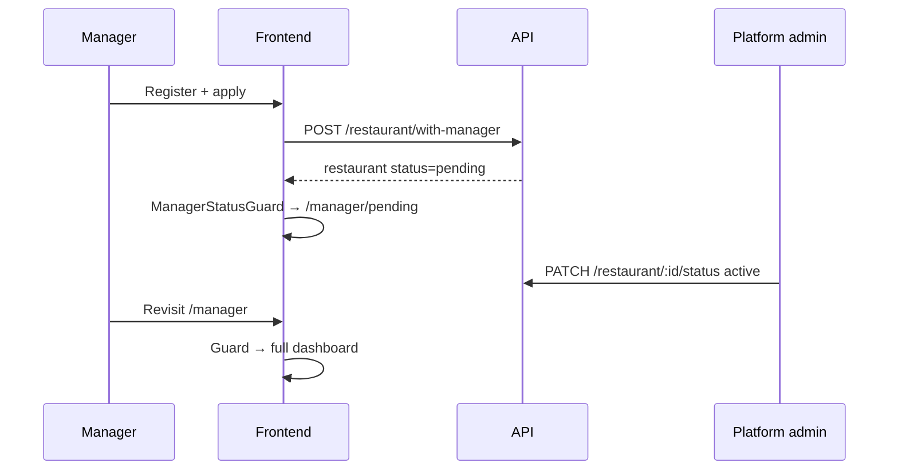
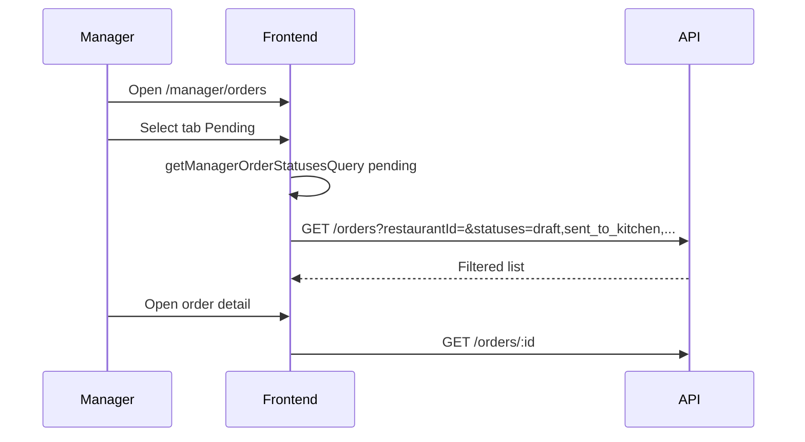
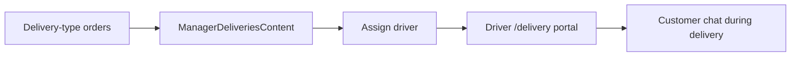
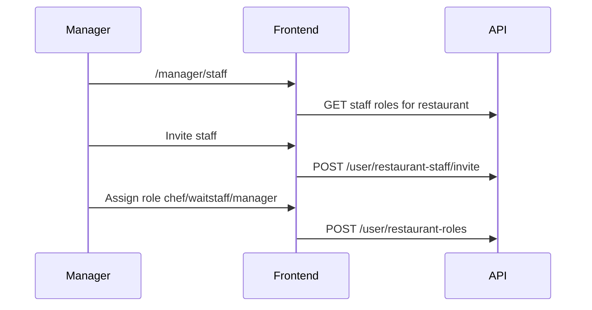
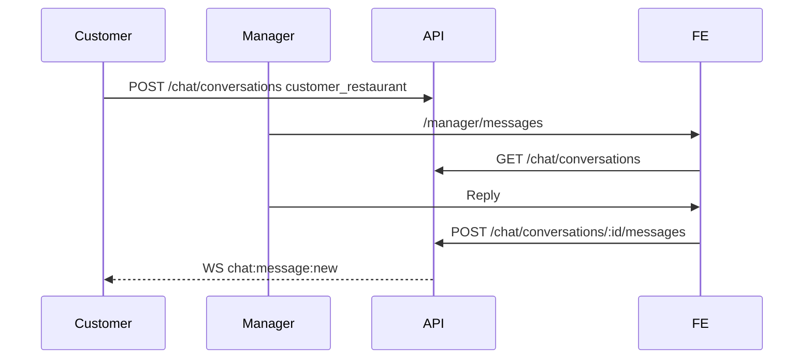
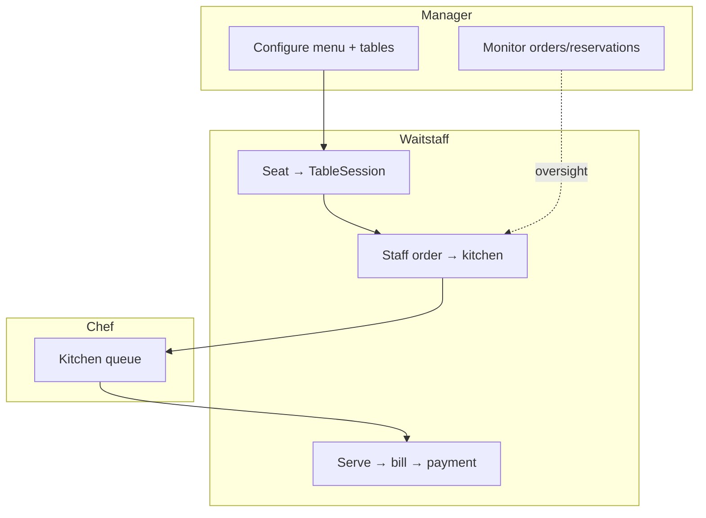

# Manager Portal — Flows

**Last updated:** 2026-06-11

Operational journeys for restaurant managers. Cross-portal dine-in flows reference waitstaff docs.

---

## 1. Onboarding & approval



**Pending page:** `/manager/pending` — no sidebar layout.  
**Suspended:** `/manager/suspended` if admin suspends restaurant.

---

## 2. Dashboard overview

```mermaid
flowchart TB
  A[/manager] --> B[getManagerDashboardData]
  B --> C[Orders limit 2000]
  B --> D[Menu items]
  B --> E[Reservations]
  A --> F[getManagerOverviewStats]
  F --> G[StatsCards revenue/items/customers]
```

**Components:** OverviewPage sections on `app/src/app/manager/page.tsx`.

---

## 3. Menu management

```mermaid
flowchart LR
  A[/manager/menu] --> B[List categories + items]
  B --> C[POST /menu-item]
  B --> D[PATCH /menu-item/:id]
  B --> E[Ingredients / add-ons modals]
  B --> F[POST upload-photo]
  B --> G[PrintableMenuSheet export]
```

**RBAC:** Requires `menu:write` (manager, owner, admin).

Categories: `category.ts` — `GET/POST/PATCH /menu-item/category`.

---

## 4. Orders — list & filter



**Tabs:** All | Pending | Completed | Cancelled  
**Mapping:** `app/src/lib/orderStatusViews.ts`

Manager may update orders where backend RBAC allows (varies by status and type).

---

## 5. Deliveries



Maps: `LeafletMap`, `SingleDeliveryMap`, `SpotDriverCard`.

---

## 6. Reservations

```mermaid
flowchart LR
  A[/manager/reservations] --> B[GET /reservations/restaurant/:id]
  B --> C[View upcoming/past]
  C --> D[PATCH status updates]
  Note over D: Waitstaff handles check-in/seating on floor
```

Customer creates reservations; manager monitors capacity. Waitstaff executes seating → `POST /table-sessions`.

---

## 7. Tables & sections

```mermaid
flowchart LR
  A[/manager/tables] --> B[TableSectionsPanel]
  B --> C[CRUD sections]
  B --> D[CRUD tables]
  D --> E[Table image, number, capacity]
```

**API:** `tables.ts`, `tableSections.ts`  
**Security note:** Prefer secured floor APIs for operational reads; SEC-001 tracks unguarded table writes.

Manager configures physical layout; **TableSession** lifecycle is waitstaff-driven.

---

## 8. Staff management



**Detail:** `/manager/staff/[id]` — individual staff view.

---

## 9. Inventory

```mermaid
flowchart LR
  A[/manager/inventory] --> B[inventory.ts]
  B --> C[List/update stock]
  C --> D[Link to menu ingredients]
```

---

## 10. Reviews

```mermaid
flowchart LR
  A[/manager/reviews] --> B[GET /review filtered by menu items]
  B --> C[Display ratings/comments]
```

Reviews tied to menu items belonging to manager's restaurant.

---

## 11. Customer messages



**Layout hook:** `useChatLive` on manager layout.

---

## 12. Notifications

Same pattern as customer — `useNotificationLive` + `/manager/notifications`.

Order events, reservation updates, and chat may generate inbox entries.

---

## 13. Settings / restaurant profile

```mermaid
flowchart LR
  A[/manager/settings] --> B[RestaurantProfileEditor]
  B --> C[PATCH /restaurant/:id]
  B --> D[Hours WeeklyHoursFields]
  B --> E[Branding / location]
```

---

## 14. Manager ↔ waitstaff ↔ chef (dine-in)



Full sequence: [../../workflow/SYSTEM_FLOWS.md](../../workflow/SYSTEM_FLOWS.md) § Dine-in.

---

## 15. Suspension & rejection

| Status | Manager experience |
|--------|-------------------|
| `suspended` | Redirect `/manager/suspended` |
| `rejected` | Logout, login blocked message |
| `pending` | `/manager/pending` only |

---

## Related

- [SPEC.md](./SPEC.md)
- [../waitstaff/WAITSTAFF_COMPLETION_REPORT.md](../waitstaff/WAITSTAFF_COMPLETION_REPORT.md)
- [../../workflow/SYSTEM_FLOWS.md](../../workflow/SYSTEM_FLOWS.md)
