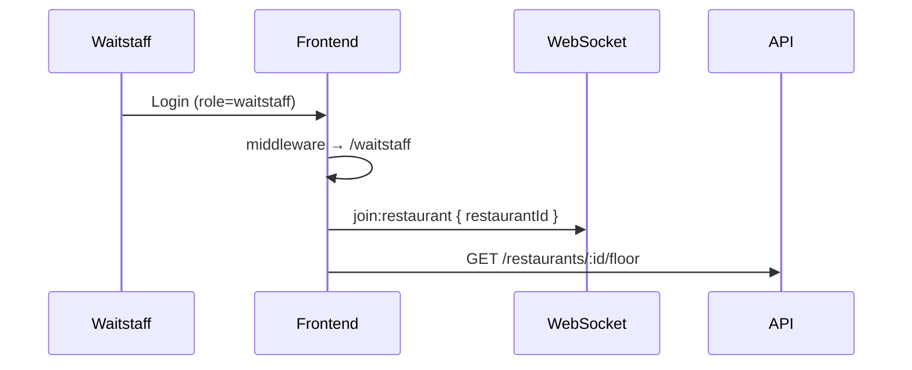
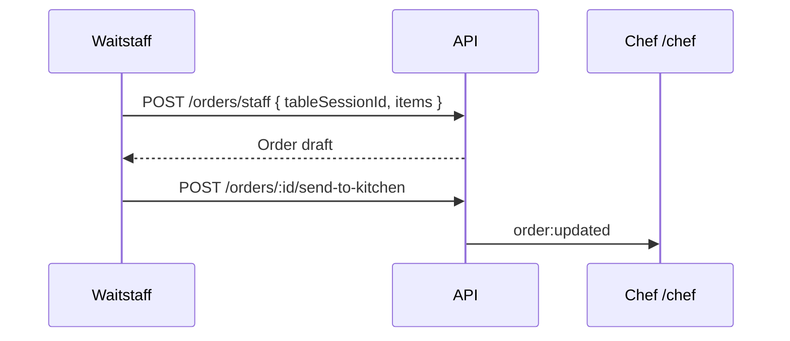
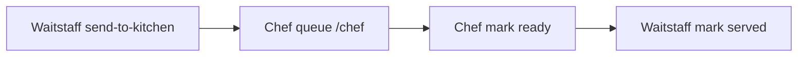

# Waitstaff Portal — Flows

**Last updated:** 2026-06-11  
**Status:** Production (Phase 8 complete)

For completion checklist and API table see [WAITSTAFF_COMPLETION_REPORT.md](./WAITSTAFF_COMPLETION_REPORT.md).  
For target spec see [UPDATED_SPEC.md](./UPDATED_SPEC.md) or [SPEC.md](./SPEC.md).

---

## 1. Waitstaff login & floor subscribe



---

## 2. Seat guest → start session

```mermaid
flowchart LR
  A[/waitstaff/tables] --> B[Select table]
  B --> C[/waitstaff/tables/tableId]
  C --> D[Walk-in or reservation]
  D --> E[POST /guests or lookup]
  E --> F[POST /table-sessions]
  F --> G[Table occupied + session ACTIVE]
```

---

## 3. Create order & send to kitchen



**UI:** `/waitstaff/sessions/[sessionId]/orders/new` → table detail order cards.

---

## 4. Serve → bill → pay → close

```mermaid
flowchart LR
  A[Chef marks ready] --> B[Waitstaff notification]
  B --> C[POST mark-served]
  C --> D[POST request-bill]
  D --> E[/sessions/id/billing]
  E --> F[POST payments]
  F --> G[POST close session]
  G --> H[Table available]
```

**Alternative exits:** `POST guest-left`, reservation `no-show`, session `EXPIRED` (cron).

---

## 5. Reservations

```mermaid
flowchart LR
  A[/waitstaff/reservations] --> B[Upcoming list]
  B --> C[Check-in]
  C --> D[POST /table-sessions with reservationId]
```

---

## 6. Realtime refresh

| Event | Action |
|-------|--------|
| `floor:updated` | Refetch floor / table detail |
| `order:updated` | Refetch orders on table |
| `table-session:*` | Session billing state |
| `payment:recorded` | Billing page totals |
| `reservation:updated` | Reservations list |

---

## 7. Messaging & notifications

- `/waitstaff/messages` — chat with manager/customers (existing chat module)
- `/waitstaff/notifications` — bell + inbox via `useNotificationLive`
- `/waitstaff/profile` — read-only role; personal prefs only

---

## 8. Chef handoff (cross-portal)



Kitchen full spec: [../kitchen/FLOWS.md](../kitchen/FLOWS.md).

---

## Navigation reference

Config: `app/src/config/waitstaffNav.ts`

| Route | Purpose |
|-------|---------|
| `/waitstaff` | Overview |
| `/waitstaff/tables` | Floor |
| `/waitstaff/orders` | Order board |
| `/waitstaff/reservations` | Reservations |
| `/waitstaff/messages` | Chat |
| `/waitstaff/notifications` | Alerts |
| `/waitstaff/shift` | Shift summary |
| `/waitstaff/profile` | Profile |

---

## Related

- [WAITSTAFF_COMPLETION_REPORT.md](./WAITSTAFF_COMPLETION_REPORT.md)
- [../../workflow/SYSTEM_FLOWS.md](../../workflow/SYSTEM_FLOWS.md) §4
- [../../security/WAITSTAFF_SECURITY_AUDIT.md](../../security/WAITSTAFF_SECURITY_AUDIT.md)
