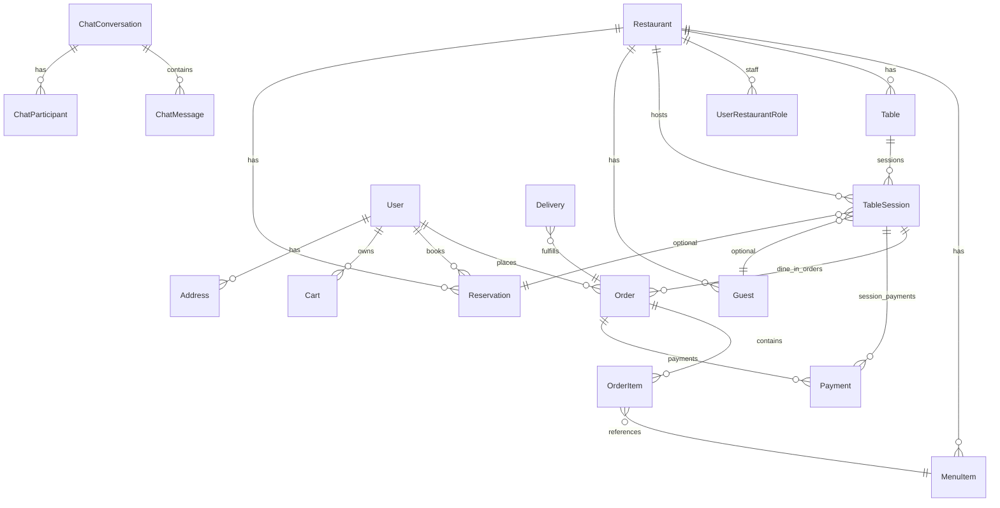

# CuisineEase — Data Model Reference

**Last updated:** 2026-06-11

Core entities and how they relate. Not a full schema dump — see TypeORM entities in `backend/src/`.

---

## Entity relationship overview



---

## Core entities

### User (`user`)

| Field / concept | Notes |
|-----------------|-------|
| `id` | UUID — primary for APIs |
| `firebaseUid` | Links to Firebase Auth |
| `role` | SystemRole: admin, user, delivery |
| Profile | fullName, email, phone, profilePhoto |

### UserRestaurantRole (`user_restaurant_roles`)

| Field | Notes |
|-------|-------|
| `userId` + `restaurantId` | Composite assignment |
| `role` | owner, manager, chef, waitstaff, delivery |

### Restaurant (`restaurants`)

| Field / concept | Notes |
|-----------------|-------|
| `status` | pending, active, suspended, … |
| Schedule, location, branding | Manager-editable |
| Catalog active gate | Orders blocked if inactive |

### MenuItem (`menu_items`)

Scoped to restaurant. Links to category, ingredients, add-ons.  
`isAvailable` flag for soft hide.

### Table (`tables`)

Physical asset. Belongs to restaurant + optional section.  
**Status:** available, occupied, reserved, out_of_service

### TableSession (`table_sessions`)

**Dine-in source of truth.**

| Field | Notes |
|-------|-------|
| `restaurantId`, `tableId` | Required |
| `status` | seated → … → completed / expired |
| `closedAt` | null = active |
| `billRequestedAt` | Set on request bill |
| `guest`, `customer`, `reservation` | Optional links |
| `assignedWaitstaffId` | Future section scoping |

### Guest (`guests`)

Walk-in identity: name, phone, email, notes — scoped to `restaurantId`.

### Order (`orders`)

| Field | Notes |
|-------|-------|
| `restaurantId` | Tenant scope |
| `customerId` | Optional for guest dine-in |
| `tableSessionId` | Dine-in link |
| `guestId` | Walk-in link |
| `waitstaffId` | Who created/served |
| `status` | Workflow enum |
| `type` | dine-in, takeout, delivery |
| `paymentStatus` | unpaid, paid, … |

### OrderItem (`order_items`)

Menu item snapshot, quantity, add-ons, price at order time.

### Reservation (`reservations`)

Customer, restaurant, table, time window, party size, payment status.

### Payment (`payments`)

Amount, method, status, gateway.  
Links: `order`, `tableSession`, `restaurant`, `customer`, `recordedBy`.

### Cart (`cart` / `cart_items`)

Pre-checkout basket per user, scoped to one restaurant at a time.

### Delivery (`deliveries`)

Assignment linking order, driver, status lifecycle.

### Chat

| Entity | Purpose |
|--------|---------|
| `chat_conversations` | Thread metadata, type |
| `chat_participants` | user ids in thread |
| `chat_messages` | Content, attachments |

### Notification

| Entity | Purpose |
|--------|---------|
| `notifications` | Template row |
| `user_notifications` | Per-user inbox row |

---

## State machines

### Order (dine-in staff workflow)

```
draft → sent_to_kitchen → preparing → ready → served → completed
  ↘ cancelled (role-dependent)
```

### TableSession lifecycle

```
Active (closedAt null)
  → Closed (completed + closedAt)
  → Expired (no-show / stale + closedAt)
```

### Table physical status

Updated on: seat (occupied), transfer, close/expiry (available), out_of_service (manual).

### Reservation

```
pending → confirmed → checked_in → seated → completed
                    ↘ no_show
                    ↘ cancelled
```

---

## Identifier rules

| Context | Use |
|---------|-----|
| API path `:id` for orders, sessions | Postgres UUID |
| JWT | Firebase UID — resolve server-side |
| WebSocket rooms | Postgres user UUID for `user:{id}` |
| Multi-tenant filter | Always `restaurantId` from role or entity |

---

## Frontend type mirrors

| Backend entity | Frontend types |
|----------------|----------------|
| Order | `app/src/type/Order.ts` |
| Menu | `app/src/type/Menu.ts` |
| Reservation | `app/src/type/reservation.ts` |
| Floor/session | `app/src/services/floor.ts` DTOs |
| Staff | `app/src/type/staff.ts` |
