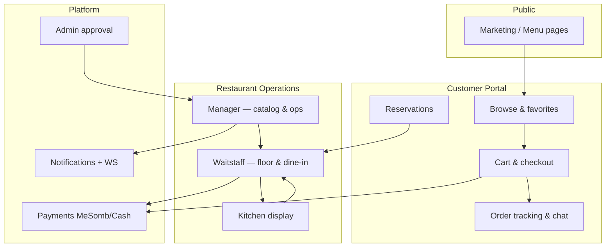

# CuisineEase — Workflow Hub

**Last updated:** 2026-06-11  
**Purpose:** Single entry point for **how the platform works** — definitions, end-to-end flows, roles, and feature-specific documentation.

---

## Start here

| Document | What it covers |
|----------|----------------|
| [DEFINITIONS.md](./DEFINITIONS.md) | Glossary, roles, entities, permission model, UI conventions |
| [SETUP.md](./SETUP.md) | Repo layout, environments, auth, multi-tenancy, migrations |
| [SYSTEM_FLOWS.md](./SYSTEM_FLOWS.md) | Cross-cutting flows (auth, orders, dine-in, delivery, chat, payments) |
| [DATA_MODEL.md](./DATA_MODEL.md) | Core entities and relationships |
| [API_MAP.md](./API_MAP.md) | Backend modules and endpoints by domain |

---

## Feature documentation

Each portal has a dedicated folder under `ai/features/`:

| Portal | Spec | Flows | Status |
|--------|------|-------|--------|
| **Customer** | [features/customer/SPEC.md](../features/customer/SPEC.md) | [features/customer/FLOWS.md](../features/customer/FLOWS.md) | Production |
| **Manager** | [features/manager/SPEC.md](../features/manager/SPEC.md) | [features/manager/FLOWS.md](../features/manager/FLOWS.md) | Production |
| **Waitstaff** | [features/waitstaff/SPEC.md](../features/waitstaff/SPEC.md) | [features/waitstaff/FLOWS.md](../features/waitstaff/FLOWS.md) | Phase 8 complete |
| **Kitchen** | [features/kitchen/SPEC.md](../features/kitchen/SPEC.md) | [features/kitchen/FLOWS.md](../features/kitchen/FLOWS.md) | Implemented |
| **Delivery** | *(minimal — see SYSTEM_FLOWS)* | `/delivery` | Partial |
| **Platform admin** | *(see PROJECT.md)* | `/dashboard` | Production |

Index: [features/README.md](../features/README.md)

---

## Security & architecture (reference)

| Document | Purpose |
|----------|---------|
| [../ARCHITECTURE.md](../ARCHITECTURE.md) | Stack, modules, deployment |
| [../DECISIONS.md](../DECISIONS.md) | ADRs — do not violate |
| [../security/WAITSTAFF_SECURITY_AUDIT.md](../security/WAITSTAFF_SECURITY_AUDIT.md) | Waitstaff RBAC matrix |
| [../SECURITY_BACKLOG.md](../SECURITY_BACKLOG.md) | Known security debt |

---

## Flow map (high level)

---

## When to update this folder

Update workflow docs when you:

- Add a new user-facing flow or portal route
- Change order / session / payment state machines
- Change RBAC or multi-tenant isolation rules
- Ship a major feature phase (add or extend `ai/features/<name>/`)

Do **not** duplicate full API listings here — link to [API_MAP.md](./API_MAP.md) and Swagger (`/api` on backend).
