# CuisineEase — System Flows

**Last updated:** 2026-06-11

End-to-end flows across portals. For portal-specific detail see `ai/features/*/FLOWS.md`.

---

## 1. Authentication & session

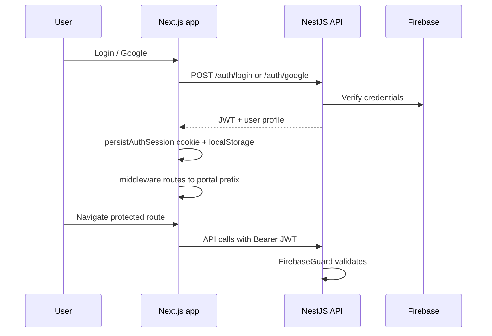

**Logout:** `POST /auth/logout` + clear client session → redirect `/`.

---

## 2. Customer — browse to cart

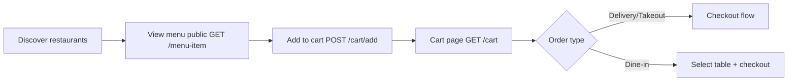

**Key APIs:** `GET /restaurant`, `GET /menu-item`, `GET /cart`, `POST /cart/add`, `PATCH /cart/item/:id`

**Frontend:** `/customer/restaurants`, `/customer/cart`, `/customer/restaurants/[id]`

---

## 3. Customer — checkout & order (delivery/takeout)

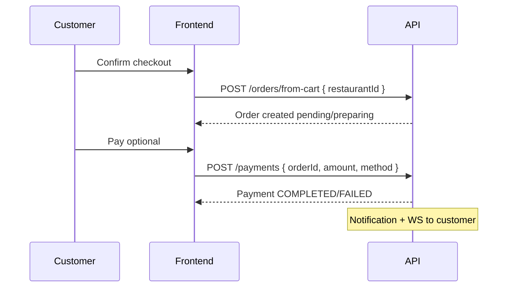

**Statuses (delivery legacy):** `pending` → `preparing` → `ready` → `delivered`

**Frontend:** `/customer/cart`, `/customer/order-history`, `/customer/order-history/[id]`

---

## 4. Dine-in — full restaurant flow (cross-portal)

This is the primary multi-role flow connecting customer, waitstaff, chef, and manager.

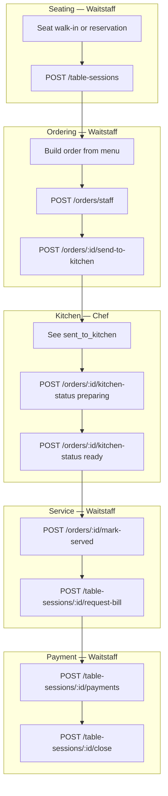

**Realtime:** Each step emits `floor:updated` / `order:updated` to `restaurant:{id}` room.

**Alternative exits:**
- `POST /table-sessions/:id/guest-left` — when bill settled or empty session
- `POST /reservations/:id/no-show` — reservation only, frees table

---

## 5. Customer — table reservation

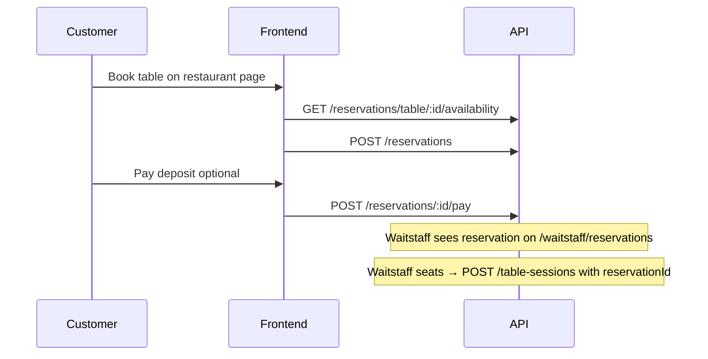

**Frontend:** `/customer/restaurants/[id]` (BookTableDialog), `/customer/reservations`

---

## 6. Manager — restaurant onboarding

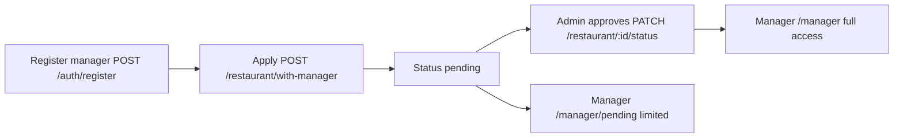

---

## 7. Manager — menu management

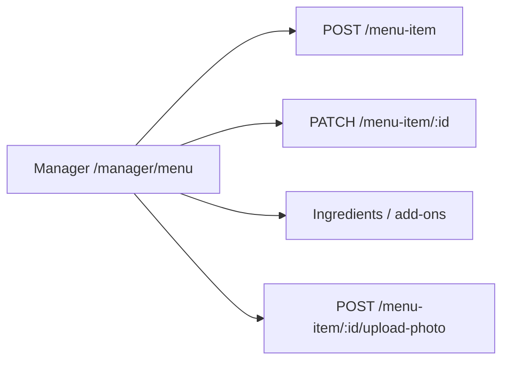

**RBAC:** `menu:write` — manager, owner, admin only.  
**Waitstaff read:** `GET /menu-item/manage/list?restaurantId=` for order building.

---

## 8. Manager — orders oversight

Manager uses **view-layer buckets** (not raw statuses):

| Tab | Backend filter (`statuses` param) |
|-----|-----------------------------------|
| All | none |
| Pending | draft, sent_to_kitchen, preparing, pending, ready, on_hold |
| Completed | served, completed, delivered |
| Cancelled | cancelled |

**Frontend:** `/manager/orders`, `/manager/orders/[id]`  
**Mapping:** `app/src/lib/orderStatusViews.ts`

---

## 9. Chat

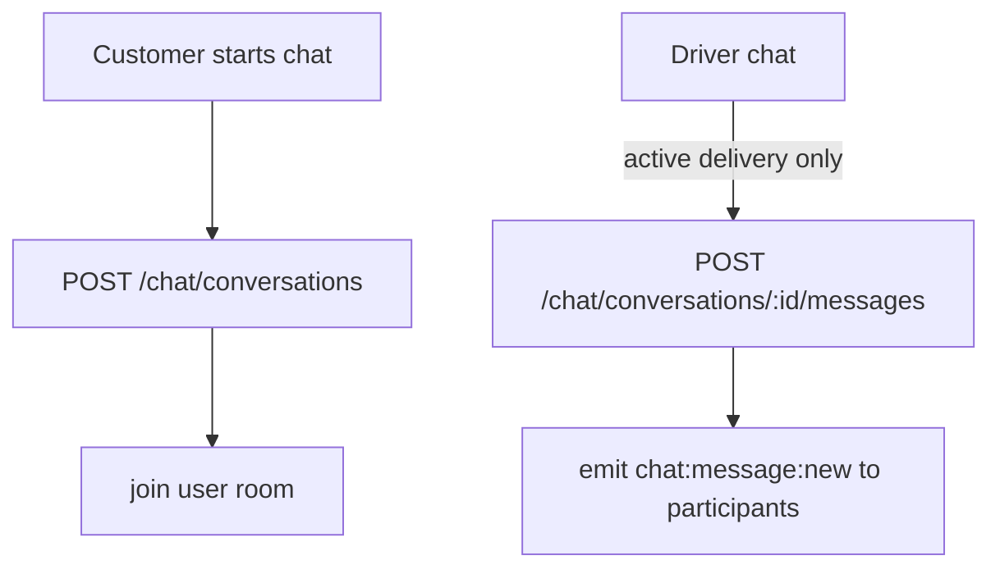

**Types:** `customer_restaurant`, `customer_driver`  
**Frontend:** `/customer/chats`, `/manager/messages`, `/waitstaff/messages`, `/delivery/chats`

---

## 10. Notifications

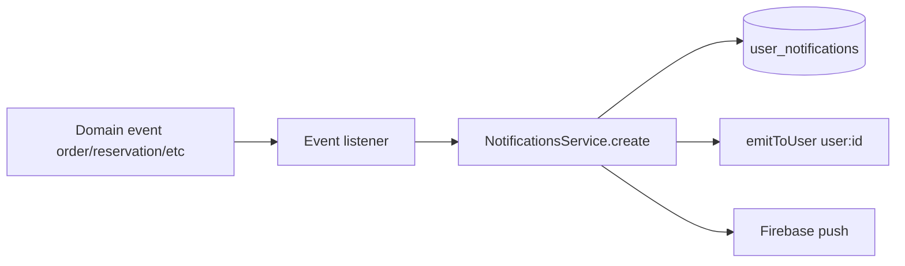

**Frontend:** Bell component + `/customer/notifications`, `/manager/notifications`, etc.

---

## 11. Realtime — restaurant floor

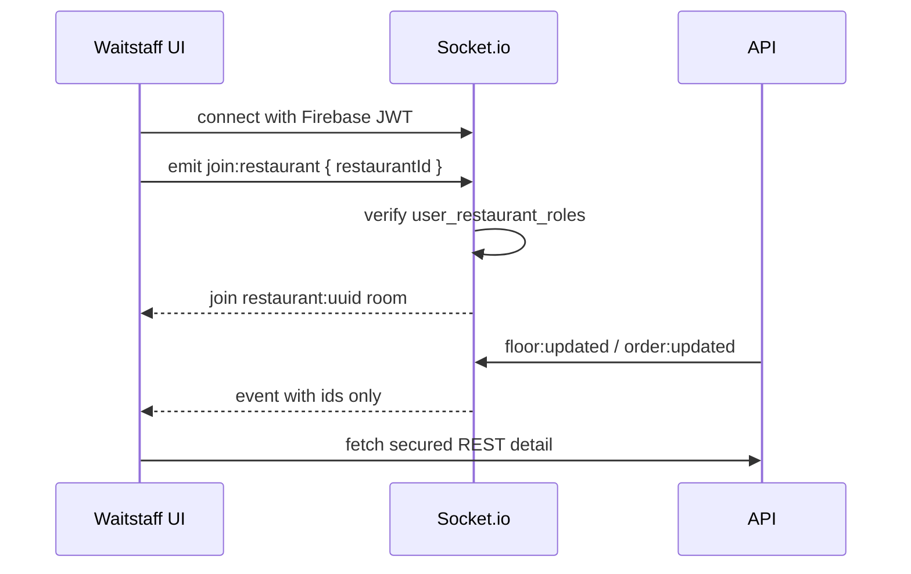

---

## 12. Delivery driver flow

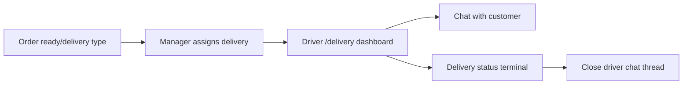

---

## 13. Platform admin

```mermaid
flowchart LR
  A[/dashboard/restaurants] --> B[List pending restaurants]
  B --> C[Approve or suspend]
  C --> D[Restaurant status active/suspended]
```

---

## 14. Table availability maintenance (background)

**Cron:** `FloorMaintenanceService` every 15 minutes

- Finds expired reservations (past `reservationTime + duration`)
- No active `TableSession` on table
- Sets reservation `no_show`, table `available`
- Emits `reservation:updated`, `floor:updated`

---

## Flow index by portal

| Portal | Primary flows |
|--------|---------------|
| Customer | Browse, cart, checkout, reservation, track, chat, profile |
| Manager | Onboarding, menu, orders, tables, staff, reservations, reviews, chat |
| Waitstaff | Floor, seat, order, kitchen handoff, serve, bill, payment, close |
| Chef | Kitchen queue, stations, analytics, staff messaging — see kitchen spec |
| Delivery | Assigned orders, customer chat |
| Admin | Restaurant approval |

See also:

- [features/customer/FLOWS.md](../features/customer/FLOWS.md)
- [features/manager/FLOWS.md](../features/manager/FLOWS.md)
- [features/waitstaff/FLOWS.md](../features/waitstaff/FLOWS.md)
- [features/kitchen/FLOWS.md](../features/kitchen/FLOWS.md)
